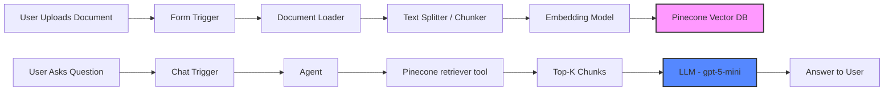
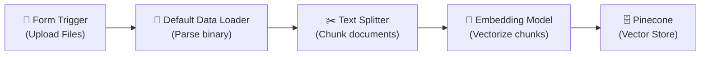
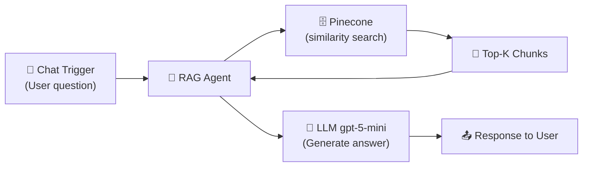
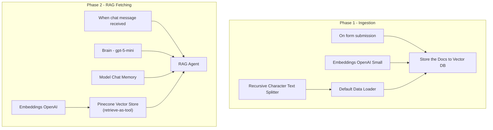
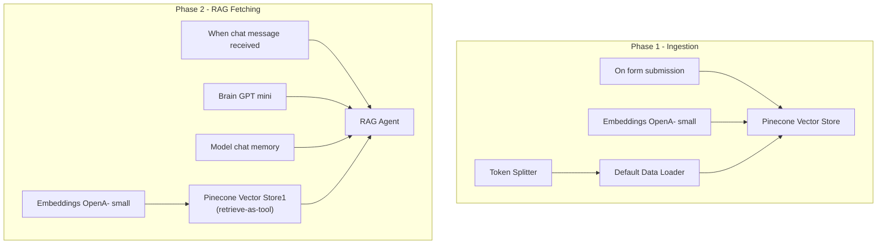
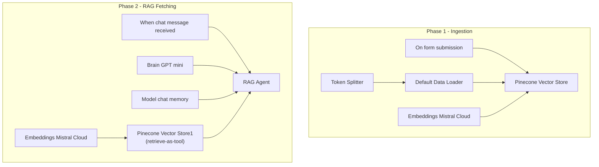

# Chapter 07 — Basic RAG Pipeline (n8n)

This chapter implements a **Retrieval-Augmented Generation (RAG)** pipeline using [n8n](https://n8n.io/), built with two different embedding models — **OpenAI** (`text-embedding-3-small`) and **Mistral** (`mistral-embed`) — while keeping the same LLM (`gpt-5-mini`) for answer generation.

## Objective

Build a basic RAG system that can:

- **Ingest** documents (PDF, CSV, JSON, DOCX, TXT, HTML)
- **Chunk & Embed** them into vector embeddings
- **Store** vectors in Pinecone vector database
- **Retrieve** relevant chunks at query time
- **Generate** grounded answers using an LLM

---

## Architecture

### High-Level RAG Flow

### Phase 1 — Ingestion (Offline / One-Time)

### Phase 2 — Retrieval & Generation (Online / Per Query)

---

## Workflows

There are **3 workflow files** in this repository:

| File | Embedding Model | LLM | Vector Index | Status |
|---|---|---|---|---|
| `n8n_BASIC_RAG/AI3X_Basic_RAG.json` | OpenAI `text-embedding-3-small` | `gpt-5-mini` | `ai3x-1536` | ✅ Active |
| `n8n_BASIC_RAG/open ai embaded model/My workflow.json` | OpenAI `text-embedding-3-small` | `gpt-5-mini` | `ragn8n-1536` | ✅ Active |
| `n8n_BASIC_RAG/mistral embaded model/RAG_Mistral.json` | Mistral `mistral-embed` (1024d) | `gpt-5-mini` | `rag-mistral` | ⏸️ Inactive |

### 1. OpenAI Embedding Workflow (`AI3X_Basic_RAG.json`)

This is the primary workflow using OpenAI's embedding model.

**Nodes:**
- **On form submission** — Webhook trigger: user uploads files (PDF, CSV, JSON, DOCX, TXT, HTML)
- **Default Data Loader** — Parses uploaded binary files into LangChain documents; captures `fileName` and `uploadedAt` metadata
- **Recursive Character Text Splitter** — Splits documents into chunks with **200 character overlap** for context preservation
- **Embeddings OpenAI Small** — Converts text chunks to 1536-dimensional vectors using `text-embedding-3-small`
- **Store the Docs to Vector DB** — Inserts vectors into Pinecone index `ai3x-1536`
- **When chat message received** — Chat trigger awaiting user questions
- **RAG Agent** — Core agent that coordinates retrieval + generation; system prompt enforces grounded answers with source citations
- **Brain - gpt-5-mini** — LLM (`gpt-5-mini`) for answer generation
- **Model Chat Memory** — Buffer window memory for conversational context
- **Pinecone Vector Store (retrieve-as-tool)** — Retrieves top-3 (topK=3) similar chunks as a tool the agent can call
- **Embeddings OpenAI** — Same embedding model used at query time (critical: must match ingestion model)

### 2. OpenAI Embedding Workflow (`My workflow.json`)

A variant of the OpenAI workflow with a slightly different layout and naming.

**Differences from AI3X_Basic_RAG:**
- Uses **Token Splitter** instead of Recursive Character Text Splitter (splits by token count rather than character length)
- Captures only `filename` as metadata (no timestamp)
- No explicit system prompt on the agent — relies on default behavior
- Uses Pinecone index `ragn8n-1536`

### 3. Mistral Embedding Workflow (`RAG_Mistral.json`)

Identical architecture to the OpenAI workflow, but uses **Mistral Cloud Embeddings** instead.

**Key differences from OpenAI workflows:**
- **Embedding model:** Mistral Cloud `mistral-embed` — outputs **1024-dimensional vectors** (vs OpenAI's 1536)
- **Pinecone index:** `rag-mistral` — separate index since vector dimensions differ
- **Workflow is inactive** (not currently running)
- Uses same LLM (`gpt-5-mini`) for generation — only the retrieval embedding model changes

---

## Components Deep Dive

### Trigger Nodes

| Node | Type | Purpose |
|---|---|---|
| **On form submission** | `formTrigger` | Webhook that accepts file uploads via a form UI with accept filters (`.pdf,.csv,.json,.docx,.txt,.html`) |
| **When chat message received** | `chatTrigger` | WebSocket trigger for the n8n chat widget; listens for user text queries (public, no auth) |

### Document Processing

| Node | Type | Purpose |
|---|---|---|
| **Default Data Loader** | `documentDefaultDataLoader` | Converts uploaded binary files into LangChain `Document` objects; supports PDF, JSON, CSV, DOCX, TXT, HTML out of the box |
| **Recursive Character Text Splitter** | `textSplitterRecursiveCharacterTextSplitter` | Splits text on natural boundaries (paragraphs, sentences) with configurable overlap (200 chars used here) |
| **Token Splitter** | `textSplitterTokenSplitter` | Splits text by token count using the model's tokenizer; used in the alternate workflows |

### Embedding Models

| Workflow | Model | Provider | Dimensions | Dimensions |
|---|---|---|---|---|
| AI3X_Basic_RAG | `text-embedding-3-small` | OpenAI | **1536** | Cheaper, fast, good general purpose |
| My workflow | `text-embedding-3-small` | OpenAI | **1536** | Same model |
| RAG_Mistral | `mistral-embed` | Mistral | **1024** | Optimized for retrieval, smaller vector size |

> **Critical Rule:** The embedding model used for indexing MUST be identical to the one used at query time. Mismatched dimensions or models produce garbage results.

### Vector Store

| Node | Configuration |
|---|---|
| **Pinecone Vector Store** | Cloud-hosted vector DB; separate indexes per model (`ai3x-1536`, `ragn8n-1536`, `rag-mistral`) |
| **Insert mode** | Used during ingestion to store new document vectors |
| **Retrieve-as-tool mode** | Used at query time; exposes vector search as a tool the agent can call with **topK=3** |
| **Metadata** | Optional fields like `fileName`, `uploadedAt` for source tracking |

### Agent & LLM

| Node | Configuration |
|---|---|
| **RAG Agent** (type `agent`, v3.1) | LangChain agent that coordinates tool calling (Pinecone retrieval) with the LLM. In AI3X_Basic_RAG, has a system prompt enforcing grounded answers with source citation. |
| **Brain / LLM** | `gpt-5-mini` via `lmChatOpenAi` — OpenAI's small, fast model for answer generation |
| **Chat Memory** | `memoryBufferWindow` — maintains conversation history for multi-turn chat |

---

## Data

The `data/` folder contains the document used for ingestion:

| File | Description |
|---|---|
| `Product Requirements Document_ VWO Login Dashboard.pdf` | A PRD document used as the knowledge base source for testing RAG retrieval |

---

## Key Takeaways

1. **Architecture is identical** across all workflows — only the embedding model provider changes
2. **Vector dimensions differ** between providers (1536 for OpenAI vs 1024 for Mistral), requiring separate Pinecone indexes
3. **Chunking strategy varies**: `RecursiveCharacterTextSplitter` with overlap vs `TokenSplitter` — choose based on your document type
4. **Same LLM** (`gpt-5-mini`) is used everywhere, keeping generation consistent while varying the retrieval embedding
5. **Metadata tracking** enables source citation, a critical feature for trustworthy RAG

---

## ⚠️ Important Notes

- Ensure API credentials are configured in n8n for **Pinecone**, **OpenAI**, and **Mistral Cloud**
- The embedding model at query time **must match** the one used during ingestion
- Pinecone indexes must exist **before** running the workflow — create them with the correct dimensions (1536 or 1024)
- The Mistral workflow is currently **inactive** — activate it in n8n after setting up the `rag-mistral` Pinecone index

---

*Built with n8n · AI 3x Blueprint · Practice 2*
