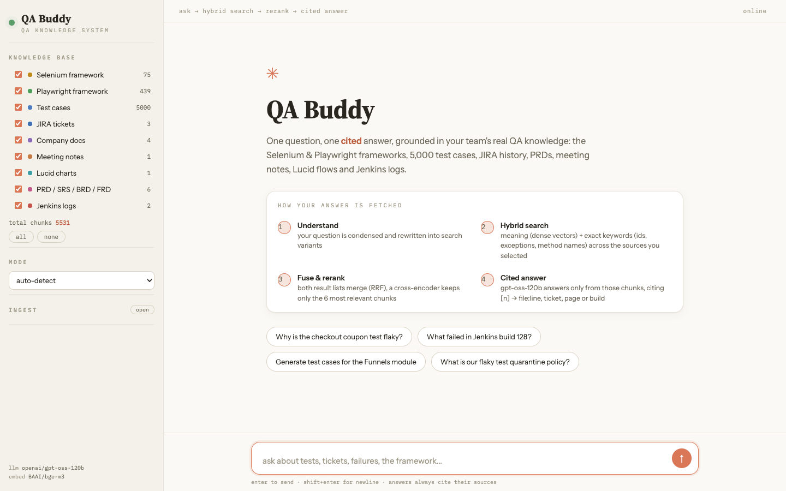
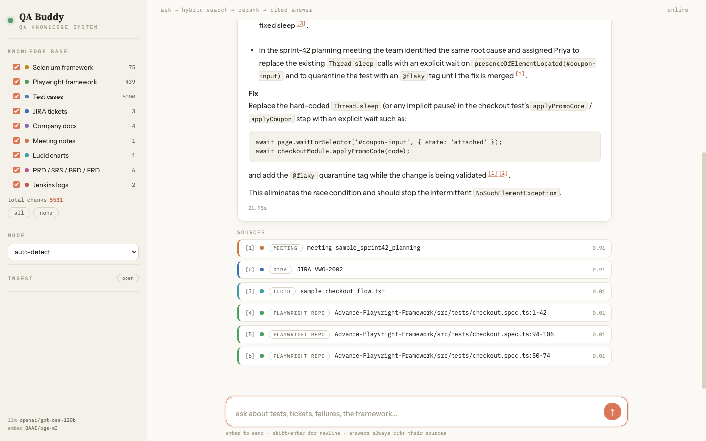

# QABuddy.ai — Multi-source Hybrid RAG for QA Engineers

One question -> one **cited** answer, grounded in 10 QA knowledge sources:
Selenium + Playwright frameworks, ~5k test cases, JIRA history, company docs,
meeting notes, Lucid flows, PRDs, and Jenkins logs.

Stack (all open source, self-hosted): **BGE-M3** (dense + lexical sparse in one
model) -> **Qdrant** (named vectors, RRF-fused hybrid) -> **bge-reranker-v2-m3**
-> **Groq-hosted `openai/gpt-oss-120b`** (open-weight LLM brain, via `.env`).

Full design + decisions: [`Plan.md`](Plan.md) · architecture: [`docs/architecture.md`](docs/architecture.md)



One RCA question, four source types cited (meeting + JIRA + Lucid + repo code with line numbers):



## Quickstart (local)

```bash
cd chapter_08_QABuddyAI
uv venv .venv --python 3.13 && uv pip install -p .venv/bin/python -r requirements.txt
cp .env.example .env                 # put your GROQ_API_KEY in it
./scripts/fetch_repos.sh             # clone the two framework repos
./scripts/setup_fixtures.sh          # demo CSV + PRD from chapter 07
.venv/bin/python -m app.ingestion.cli ingest --all
.venv/bin/python -m pytest tests -q  # 12 unit tests
.venv/bin/python scripts/eval.py     # retrieval hit-rate on golden questions
./scripts/dev.sh                     # UI on http://127.0.0.1:5080
```

## Daily use

| Action | Command |
|---|---|
| Ask questions | open the UI, filter sources, ask (modes: answer / generate / review / RCA) |
| Add documents | drop files in `data/NN_*/`, run `ingest --source NN` (or UI ingest panel) |
| Re-sync repos | `./scripts/fetch_repos.sh && ... ingest --source 01` (only changed files re-embed) |
| Pull JIRA | `scripts/jira_fetch.py` (REST+JQL) or MCP pull -> `data/04_jira_tickets/*.json` |
| KB stats | `.venv/bin/python -m app.ingestion.cli stats` |

## Layout

```
app/core        embedder (bge-m3), store (Qdrant), rrf fusion, reranker, chunkers
app/ingestion   per-source loaders, idempotent pipeline (manifest diff), CLI
app/retrieval   ask pipeline: condense -> rewrite -> hybrid -> rerank -> cite
app/server      Flask API (SSE chat + ingest) + terminal-style chat UI
data/01..10     the 10 sources (payloads gitignored, samples committed)
scripts/        fetch_repos, setup_fixtures, jira_fetch, eval, backup, dev
docs/           architecture, droplet deploy runbook, phase 2 plan, JIRA how-to
```

## Deploy (droplet)

Files ready: `docker-compose.yml` (qdrant + app + caddy TLS/basic-auth),
`Dockerfile`, `Caddyfile`, `scripts/backup.sh`. Runbook: [`docs/deploy-droplet.md`](docs/deploy-droplet.md).

Phase 2 (planned, not built): hourly auto-ingest cron, Figma ingestion, QABuddy
MCP server for IDE copilots. See [`docs/phase2.md`](docs/phase2.md).

**Note (local embedded Qdrant):** one process at a time owns `qdrant_data/`.
While the server runs, ingest through the UI panel (same process), not the CLI.
On the droplet compose runs Qdrant as a server, so this limit disappears.
